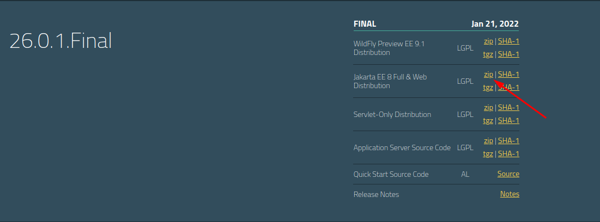

## Instalação

Para rodar o projeto, é necessário utilizar o servidor WildFly. 
Para isso, execute os passos abaixo:
- Acesse https://www.wildfly.org/downloads/ e baixe a última versão 
disponível indo no quadro da última versão (26.0.1.Final, no momento) 
e clicando em "zip" ao lado do texto "Jakarta EE 8 Full & Web Distribution":

- Após o download, extraia o servidor em uma pasta de sua escolha;
- No IntelliJ, clique em "Edit configurations" no canto superior direito, 
depois clique em "+" > "JBoss/WildFly server" > "Local";
- Na configuração que abrirá, ao lado de "Application server", clique em "Configure" para adicionarmos o novo servidor;
- Clique em "+" e busque pelo diretório onde você excluir o servidor. Se o diretório estiver correto, aparecerá a versão 26.0.1.Final abaixo da caixinha;
- Clique em OK duas vezes para fechar a configuração do novo servidor;
- Certifique-se de que o servidor selecionado em "Application server" seja o WildFly 26.0.1.Final;
- No final da tela, estará aparecendo um erro dizendo que nenhum artefado foi marcado para colocarmos no servidor. 
Clique em "Fix", escolha "projeto.war " e clique em "OK" para finalizar a configuração;
- Para testar se tudo funcionou corretamente, tente rodar o sistema clicando em "Run" ou "Debug". 
